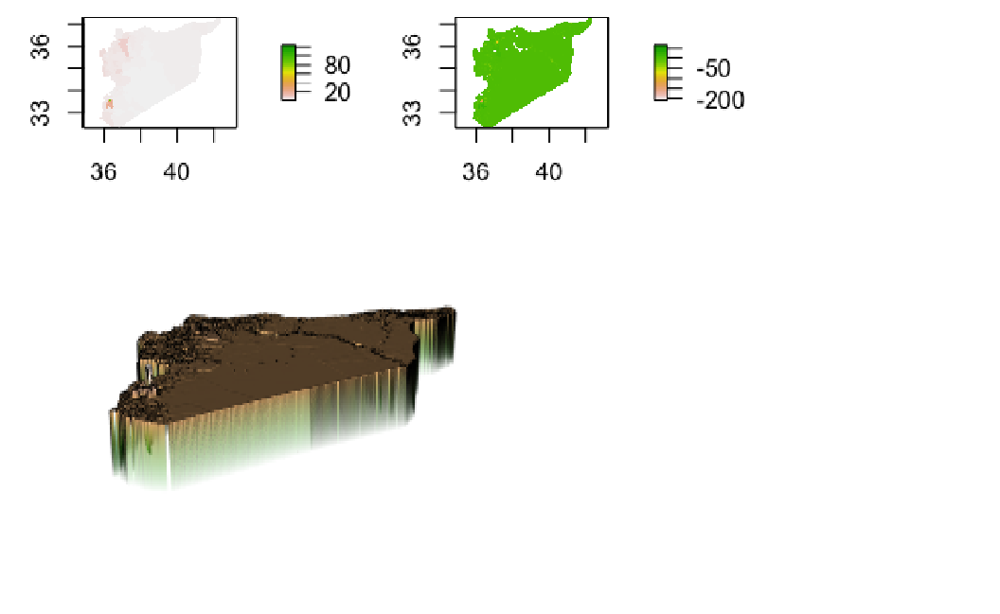

# Syria
The following investigates The Arab Republic of Syria. It includes administrative subdivisions, spatial distributions, populations, topography, and infrastructure.

## A Basic Overview of Syria's Administrative Subdivisions
### Focus on Aleppo and Damascus

Syria has 14 governorates, or district 1 levels; there are 60 districts, or district 2 levels. Highlighted in orange are the districts of Jarablus and A'zaz located in the governorate of Aleppo. The aforementioned are the districts I chose to focus on throughout the project.

## Population Distribution throughout Administrative Subdivisions
### Governorates: District 1

By far the most highly populated governorate is Aleppo. It holds 23.2% of Syria's total population. However, it's density is only a moderate size at 302.41 persons/km^2. Damascus, although only having 8.0% of Syria's total population, has the highest density at 17698.61 persons/km^2. The two most highly populated cities in Syria are Aleppo, with about 1.6 million inhabitants, and Damascus (the capital), with about 1.55 million inhavitants as of 2019. The difference in density arises because of the massive surface area of Aleppo contrary to that of Damascus.

### Districts: District 2

When comparing districts within governorates, the five largest are as follows:
1. Jebel Saman (Aleppo)
2. Damascus (Damascus)
3. Homs (Homs)
4. Rural Damascus (Rural Damascus)
5. Hama (Hama)

These districts are concentrated on the western end of Syria, which borders Palestine, Lebanon, the Mediterranean Sea, and Turkey. They are concentrated around the 2 largest cities, Aleppo to the North, and Damascus to the South. 

## Log of Population of Syria's Districts

When taking the log of population, it is evident that the district of Jebel Saman in Aleppo is the most highly populated because it contains the city of Aleppo. The districts of Damascus and Homs (located within the governorate of Homs) have the second largest logs of population.

*Note: there is a discrepancy in the district boundaries between maps. The data I originally used was from HDX and had 62 districts, but was corrupt. I switched to data from GADM that has 60 districts.* 

## An Examination of Predictions of Populations versus Actual
### Syria

*Left: actual logpop of population; Right: difference in prediction of logpop vs actual.*
*Bottom: A 3D model of the difference in prediction of logpop vs actual. The model is actually relatively accurate, however underestimates population particularly in the heavily populated west.*

The model that produces the best results is the response variable logpop with the predictors being the mean of covariates. Almost all of Syria is green, indicating the population prediction was quite close to the actual. The absolute value of the difference is 27974215.

Within the districts of Jebel Saman, Damascus, and Al-Malikeyyeh, the residual difference is the largest. The prediction model was not at all close to accurate, with the adjusted R-Squared being 0.0502. If these 3 major outliers were removed it would be somewhat more accurate. However, due to the population size of the districts, it isn't surprising that there is a discrepancy. Collecting accurate data in such a region is difficult. 

### Damascus

Considering that Damascus is the second largest city, and has the highest density of all districts in Syria, it has the most opportunity for discrepancy. There is a large underprediction within the southwestern portion of the city, whereas in the northeast the population is overestimated.  This can also be observed in the residual plot above.

## Human Settlements, Roadways, and Healthcare Facilities throughout A'zaz and Jarabulus, Syria

Above are the districts of A'zaz and Jarabulus, located in the governorate of Aleppo. A'zaz is to the west and Jarabulus to the east. Both districts border Turkey. Most of the urban areas and population are concentrated on the western border of A'zaz. The rest are mainly located on the eastern border of Jarabulus. Although several junctions occur between roads in urban areas throughout the districts, they tend to be secondary and tertiary. The primary roads are located in the middle, 

 

#### Human Settlements
Within the districts of A'zaz (to the west) and Jarabulus (to the east), the majority of urban settlements are concentrated near the eastern and western borders. A'zaz has more settlements, a higher population, and a higher density than does Jarabulus. This can be explained by the presence of water. Jarabulus lies within the Fertile Crescent, its eastern border next to the Euphrates. To the west of A'zaz, although outside the border of the district, is Maydanki Lake. The middle of the districts is relatively dry and mountainous.

|District | Population | Urban Areas | Urban Population | % in Urban Areas |
|---------|:----------:|:-----------:|:----------------:|:----------------:|
|A'zaz    |399,618     |10           |166,616           |32.5%
|Jarabulus|114,214     |2            |28,410            |5.5%
|Total    |513,832     |12           |195,028           |38.0%             |

#### Roadways
It takes about three hours to cross the districts and get from A'zaz to Jarabulus on a secondary road. Roads tend to weave between mountains in valleys, as there is no way to go around them. The only primary roads located in the district run perpindicular to the generally horizontal shape of the area, disconnected from any major settlments or cities. There is a correlation between urban areas and junctions of secondary and tertiary roads within them. Regardless of the fact that the middle of the area is quite sparsely populated, it is relatively well connected to the eastern and western ends of the districts. 

|District | Total Roadway Networks | Total Length | Classification (P,S,T) |
|---------|:----------------------:|:------------:|:-----------------------|
|A'zaz    |368                     |859.8km       |29, 55, 284             |
|Jarabulus|249                     |750.7km       |78, 57, 156             |
|Total    |617                     |1,610.5km     |140, 219, 594           |

#### Healthcare Facilities
The state of healthcare within Jarabulus and A'zaz is dismal. The Syrian healthcare system is decentralized with 3 levels: village, district, and provincial, and has public and private aspects. There are only 4 healthcare facilities in the area, all to the complete west near the city of A'zaz. Those in southwest A'zaz or anywhere in Jarabulus face a long trip to a hospital, dangerous in an emergency. In addition to the uneven distribution of medical care, the infrastructure is incredibly degraded due to conflict, with a lack of supplies due to sanctions. The Syrian International Coalition for Health (SICH), created in 2012, attempts to tackle these problems. However, they have faced limited success. Because of the conflict, more injuries are caused and more healthcare facilities are destroyed, putting civilians in the area at an insanely high level of risk. 

|District | Total Number of Facilities | Persons Per Facility |
|--------:|:--------------------------:|:---------------------|
|A'zaz    |4 hospitals, 0 clinics      |99,905                |
|Jarabulus|0 hospitals, 0 clinics      |28,553                |
|Total    |4 hospitals , 0 clinics     |128,458               |

 *Left: a destroyed hospital in A'zaz. Worldvision. Below: Muhammed Wassim Maaz Hospital, A'zaz. Google Maps.*

