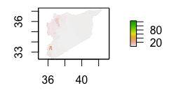
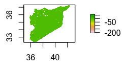

# Syria
The following investigates The Arab Republic of Syria. It includes administrative subdivisions, spatial distributions, populations, topography, and infrastructure.

## A Basic Overview of Syria's Administrative Subdivisions
### Focus on Aleppo and Damascus

Syria has 14 governorates, or district 1 levels; there are 60 districts, or district 2 levels. Highlighted in orange are the districts of Jarablus and A'zaz located in the governorate of Aleppo. The aforementioned are the districts I chose to focus on throughout the project.

## Population Distribution throughout Administrative Subdivisions
### Governorates: District 1

By far the most highly populated governorate is Aleppo. It holds 23.2% of Syria's total population. However, it's density is only a moderate size at 302.41 persons/km^2. Damascus, although only having 8.0% of Syria's total population, has the highest density at 17698.61 persons/km^2. The two most highly populated cities in Syria are Aleppo, with about 1.6 million inhabitants, and Damascus (the capital), with about 1.55 million inhavitants as of 2019. The difference in density arises because of the massive surface area of Aleppo contrary to that of Damascus.

### Districts: District 2

When comparing districts within governorates, the five largest are as follows:
1. Jebel Saman (Aleppo)
2. Damascus (Damascus)
3. Homs (Homs)
4. Rural Damascus (Rural Damascus)
5. Hama (Hama)

These districts are concentrated on the western end of Syria, which borders Palestine, Lebanon, the Mediterranean Sea, and Turkey. They are concentrated around the 2 largest cities, Aleppo to the North, and Damascus to the South. 

## Log of Population of Syria's Districts

When taking the log of population, it is evident that the district of Jebel Saman in Aleppo is the most highly populated because it contains the city of Aleppo. The districts of Damascus and Homs (located within the governorate of Homs) have the second largest logs of population.

*Note: there is a discrepancy in the district boundaries between maps. The data I originally used was from HDX and had 62 districts, but was corrupt. I switched to data from GADM that has 60 districts.* 

## An Examination of Predictions of Populations versus Actual
### Syria

The model that produces the best results is the response variable logpop with the predictors being the mean of covariates. Almost all of Syria is green, indicating the population prediction was quite close to the actual. In addition, the absolute value of the difference is 27974215, the lowest of each of the predictors. There is a slightly raised area around Damascus, which was the area with the most inaccurate prediction. This is reasonable considering Damascus has a massive population, and therefore the most opportunity for discrepancy.

### Damascus

